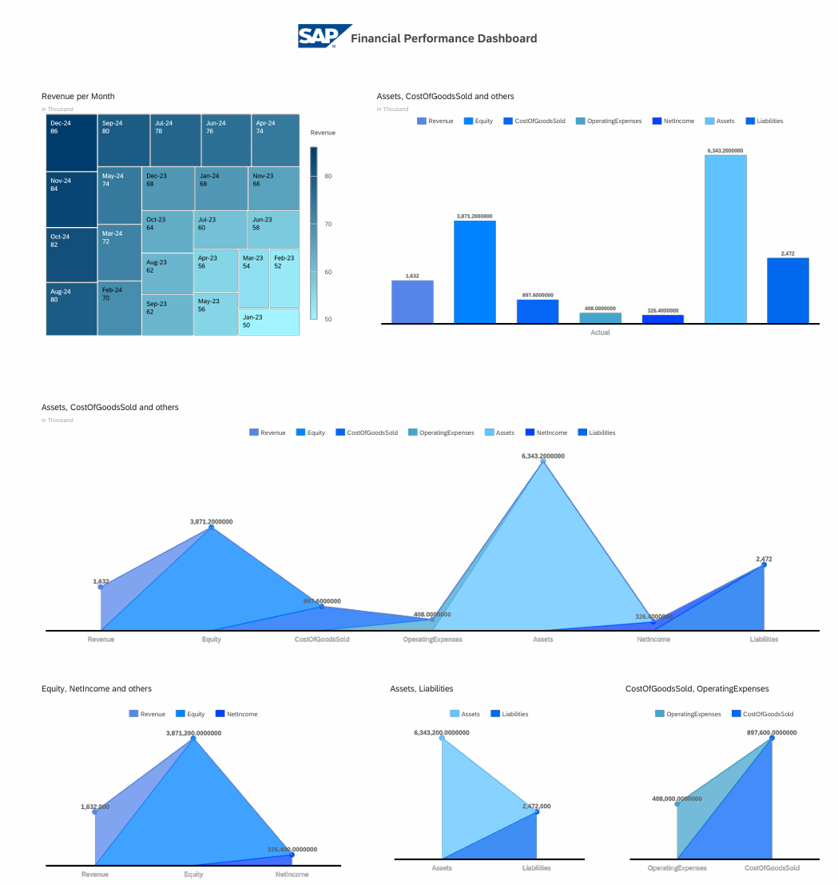

# SAP Analytics Cloud Dashboards Project

## Overview
This project demonstrates my skills in SAP Analytics Cloud through three functional dashboards:
1. Finance Dashboard - P&L, Balance Sheet, and Cash Flow analysis
2. Sales Dashboard - Pipeline, forecasting, and regional analysis
3. HR Dashboard - Attrition, hiring, and headcount analytics

## Features
- Interactive data visualizations
- Time-series forecasting
- Planning models
- Drill-down capabilities
- Responsive design

## Technologies Used
- SAP Analytics Cloud
- Data modeling in SAC
- Predictive analytics
- Planning scenarios

## Setup Instructions
1. Obtain SAP Analytics Cloud trial account
2. Import provided CSV files into SAC
3. Create models with specified measures and dimensions
4. Build visualizations as documented

## Dashboard Screenshots

